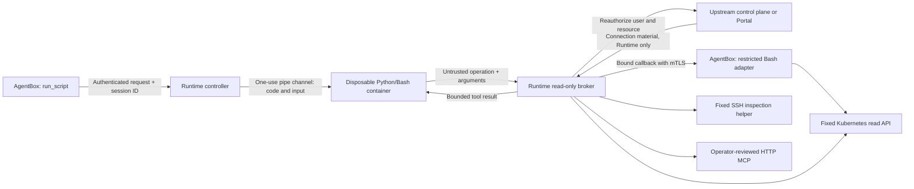
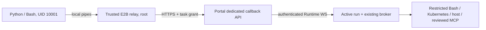

# Disposable script sandbox

Status: opt-in implementation. `run_script` supports Bash and Python's standard
library in a separate container. Both the feature and optional network isolation
default to **off**. Kubernetes deployments support native Jobs or optional E2B.
LocalSpawner and TUI deployments always disable this feature, regardless of
environment settings. Docker is only used by the standalone smoke harness.

## Security contract



The runner has no AgentBox filesystem, service account token, kubeconfig, SSH
key, MCP token, cloud environment or Runtime certificate. It receives only code,
JSON input, and a pipe protocol. Code must not embed credentials in its own input.
Requested resource names narrow authority; they do not grant it. Raw credentials,
identity fields, arbitrary images, mounts, environment and connection addresses
are rejected as tool parameters.

Runtime derives the Agent identity from its existing authenticated AgentBox
transport and passes the session ID to `sandbox.resolve`. The upstream control plane additionally
checks the authenticated Runtime owns the Agent, the session belongs to that
Agent, and the user still has access. Cluster/host access is the intersection of
the user's module/resource group grants and the Agent's current resource
bindings. Credentials are resolved again for each operation and stay in trusted Runtime
connectors or the existing AgentBox credential store. They never travel through
the sandbox channel. Connector errors are replaced
with generic errors; audits contain identities, run/instance IDs, code hashes,
operation outcomes and timing, without code or credentials.

Both Web entry points atomically claim a new session ID for the authenticated
user before subscribing to events or dispatching a turn. Existing IDs must
match the user, Agent and live Web session; conflicting inserts preserve the
original owner, lineage, title and message sequence.

Runtime additionally binds each script to the current authenticated Web turn.
The saved session owner is compared with this caller, never used as a substitute
for it. An explicit `origin: "web"` is required from the control plane; missing
or non-Web origins and delegated turns fail closed. Each tool operation and
result chunk rechecks the live caller. Mixed users or entry types make the
whole overlapping turn ineligible until it finishes, including steers. Ending
the turn removes its authority; restart cannot reconstruct it from an old
session row. This also prevents an API request from enabling a sandbox by
reusing its owner's saved Web session ID.

Initial access is limited to non-delegated, logged-in **Web sessions**. Channel,
API, task, sub-agent and delegated sessions are excluded until the current
requester's identity can be verified independently of session ownership.
Standalone Portal has no resource RBAC, so it requires an administrator-owned
Web session and still enforces Agent resource bindings. TUI-only execution is
not exposed. LocalSpawner ignores sandbox configuration before loading secrets
or initializing providers, advertises the feature as disabled, and rejects
execution and external tool callbacks. Agents receive no `run_script` tool.

Existing legacy `*_exec`/`*_script` and direct AgentBox MCP tools are separate
capabilities. This feature constrains code inside the new sandbox; it does not
retrofit the entire AgentBox into an untrusted-code boundary. The broker never
dispatches through the general tool registry. `run_sandbox` grants only
`run_script`; `run_scripts` retains the legacy Skill tools. Use a custom Agent
with only `run_sandbox` for a sandbox-only workflow: direct MCP discovery and
tool injection are disabled for that selection, including session rebuilds.
Bound MCP resources remain accessible through the reviewed broker policy.
The SRE preset intentionally
retains both capabilities. Empty capability selection remains unrestricted.

## What “read-only” means

| Sandbox operation | Enforced behavior |
| --- | --- |
| `bash` | Single scoped `kubectl get nodes/pods` through the existing restricted Bash tool. No arbitrary shell, Skill, connection flags, pipeline or other resource types. |
| `k8s.list_pods` | Fixed HTTPS GET of one declared namespace; up to 10 pod summaries per page with an opaque `continue` token. No spec/env/secret dump or condition messages. |
| `k8s.list_nodes` | Fixed GET of `/api/v1/nodes`, up to 10 summaries per page with an opaque `continue` token. Requires explicit `clusters[].nodes: true` and Kubernetes `nodes/list` RBAC. Returns name, Ready/scheduling state, software versions, architecture, capacity and allocatable resources; no annotations, labels, addresses, image inventory or full node object. |
| `k8s.pod_logs` | Fixed GET of one named pod's log, bounded to 64 KiB and 1–1,000 tail lines. |
| `host.inspect` | Fixed SSH command `/usr/local/libexec/siclaw-inspect`; only `os`, `memory`, `sysctl` checks. No model-supplied command or path. |
| `mcp.call` | Only an explicitly declared and operator-reviewed tool on a bound HTTPS Streamable HTTP MCP server. Operator fixed arguments cannot be overridden. |

No Kubernetes mutation, exec, attach, proxy, Secret access or arbitrary API path
is accepted by the broker. Kubernetes authentication accepts inline token or
client certificate/key data with TLS verification; exec plugins, auth providers,
file references, proxy settings and impersonation are rejected. HTTP redirects
are not followed. MCP `readOnlyHint` is not authorization: the operator must
review the tool implementation and constrain tenant/resource arguments, or leave
it disabled. MCP credentials should independently carry read-only permissions.
An operator-reviewed MCP tool is a trusted extension of the broker boundary.

Node scope is cluster-wide and independent of namespace scope. Declaring a
namespace does not allow node reads; declaring `nodes: true` does not allow Pod
reads. Node and Pod pages are limited to 1 MiB upstream, then projected to fixed fields.
Continuation tokens are bounded to 4,096 characters and encoded as query data;
they cannot change the API path, HTTP method or page size. Every page is
reauthorized. Scripts must follow pagination to enumerate all nodes/pods and surface
an incomplete result if execution or tool-call budgets are exhausted. The chart
does not grant node permissions; configure them only on the selected diagnostic
credential, never on the runner ServiceAccount.

A script executing `ssh node rm ...` has no SSH credential in either profile.
With network isolation enabled it also cannot create the socket, even via a
subprocess or raw syscall. `siclaw.call("host.inspect", ...)` reaches only the
fixed helper. Neither command string inspection nor a “read-only SSH account”
alone is used to classify arbitrary shell programs as safe.

Read-only concerns production mutations. The script can freely create/delete
its own disposable work files. Reads may still produce server audit records,
affect access times or retrieve sensitive diagnostic content such as logs.

## Built-in tool callback

Python calls `call("bash", {"cluster": "prod", "command": "kubectl get nodes -o wide"})`;
Bash calls `siclaw-tool bash '{"cluster":"prod","command":"kubectl get nodes -o wide"}'`.
A declared cluster/node or namespace scope is still required. Supported output
formats are default table, `wide`, `name`, and `custom-columns` using fixed
non-secret diagnostic paths. For example:

```python
from siclaw import call
print(call("bash", {
    "cluster": "prod",
    "command": "kubectl get nodes -o custom-columns=NAME:.metadata.name,CPU:.status.capacity.cpu,VERSION:.status.nodeInfo.kubeletVersion"
})["text"])
```

The strict grammar allows only `get nodes/pods`, an optional name, one explicit
namespace for Pods, and one output format. Node custom columns allow name,
kubelet/kernel/OS/architecture/container runtime versions, CPU/memory capacity
and allocatable, and scheduling status. Pod columns allow name, namespace,
phase and node name. JSON/YAML, arbitrary JSONPath/templates, Secret/ConfigMap,
resource aliases/groups, watches, subresources and endpoint/auth overrides are
rejected. Canonical quoted argv are rebuilt and checked by the shared pre-exec
and read-only kubectl policies. Tools have a 10-second API request deadline and
1–15 second command budget; output uses the existing Bash sanitizer and limits.
Use `k8s.list_nodes` pagination for complete structured inventories.

Runtime reauthorizes the current resource and routes only to the original
AgentBox placement. AgentBox verifies a random, per-invocation callback grant,
its original immutable scope, the Web session, and the strict command profile
again before executing `createRestrictedBashTool`. Callback grants remain only
between trusted processes, are omitted from audit, and expire on completion or
cancellation. The endpoint does not accept tool names, environment, cwd or
background execution, and does not wait on the model prompt queue. K8s callbacks
require a CA-verified Runtime/Gateway certificate; checking its OU alone is
insufficient. Local Runtime never exposes sandbox execution or callbacks.
Runtime supplies the freshly authorized inline kubeconfig only to this trusted
AgentBox endpoint. AgentBox validates it and writes a unique per-call snapshot,
readable only by its owner and the existing setgid kubectl reader. The callback
uses that snapshot instead of the shared credential cache and removes it in a
`finally` block. A concurrent credential refresh or cluster-name rebind cannot
substitute an older/different credential after authorization. This material is
never included in the script request, SDK channel, audit or tool result.
Cancellation propagates to the built-in
tool and callback responses are bounded.

All connector text, including logs and nested MCP text, passes through shared
output redaction. Pattern-based redaction does not prove arbitrary diagnostic
content contains no secret; reviewed MCP implementations and limited upstream
credentials remain part of the trust boundary.

## Large results and work files

Use `call_to_file` for complete, bounded **sanitized** results. The normal
`call` response remains limited to 128 KiB. File delivery allows 4 MiB per result
and 16 MiB cumulatively per run; it does not bypass a connector's pagination,
field projection or log-window limits.

```python
import json
from siclaw import call_to_file
info = call_to_file("mcp.call", {
    "server": "metrics", "tool": "query", "arguments": {}
}, "data.json")
with open(info["path"]) as data:
    result = json.load(data)
# Aggregate/filter result here, then print only the final answer.
print({"bytes_processed": info["bytes"]})
```

```sh
siclaw-tool --output data.json mcp.call '{"server":"metrics","tool":"query","arguments":{}}' > receipt.json
python3 -c 'import json; data=json.load(open("data.json")); print(type(data).__name__)'
```

The SDK requests `delivery: "file"`; no file path or download URL is sent to
Runtime. Runtime executes the authorized tool once, sanitizes its response and
holds at most one 4 MiB result buffer for that run. This is bounded buffering,
not unlimited upstream streaming. A random run-local transfer ID identifies the
buffer. `result.read` returns sequential chunks of at most 48 KiB, reauthorizing
the **original** user/resource on each chunk without repeating the operation.
Skipped/replayed offsets, other runs, cancelled runs and revoked resources are
rejected. Data is discarded at EOF, explicit `result.discard`, or run completion.
Chunk requests have a separate bounded protocol budget and do not consume the
64 upstream tool-call slots. Failed/discarded files still consume the cumulative
admitted-byte budget.

Python and Shell share the same SDK. It checks byte count and SHA-256 before an
atomic replacement inside the current work directory. Failure removes partial
files and preserves an existing destination. Complete files live only in this
run; process them before returning. The SDK performs no automatic retry of the
original operation. Public callback request/response limits remain 256 KiB;
Portal and external control planes only relay small messages to the original
live Runtime. No object store, public download endpoint or file credential is
needed.

The trusted Bash callback uses the shared sanitizer in data mode, without the
chat renderer's truncation or host temporary files. Runtime caps the internal
callback at 4 MiB; existing Bash execution capture limits still apply and
capture failures are rejected. Only script stdout/stderr reaches the Agent,
with the existing combined 128 KiB limit and explicit `output_truncated` flag.
Scripts should inspect all required pages and print a concise summary, not dump
raw files to stdout. Data too large for these budgets requires narrower queries
or pagination; partial data is never presented as a successful file.

Deploy matching Runtime, AgentBox and runner images. Runner readiness protocol
version **2** requires the UTF-8 and file SDK; old native images or E2B templates
fail the handshake before receiving task data. Rebuild the E2B template when
upgrading the SDK. No model call, package installation or extra service is added
to sandbox startup.

## Optional network isolation

`network_isolation` defaults to the Runtime setting (off). Administrators may
set `requireNetworkIsolation=true`; a request cannot weaken it. Failure to load
the filter or start the requested profile aborts execution, without fallback.

The immutable native launcher closes extra descriptors, rejects inherited socket
stdio, resets environment/limits, sets `no_new_privs`, and installs a Linux
seccomp **syscall allowlist before Python loads**. The allowlist applies to the
supervisor and descendants. It denies sockets, io_uring, ptrace, process_vm,
pidfd_getfd, namespace entry/creation and unknown ABIs/syscalls. It permits only
the filesystem/process primitives needed by Bash and stdlib Python. `clone3`
returns ENOSYS so libc can use the inspectable `clone` fallback. The container
also uses a distinct non-root UID per instance, read-only rootfs, dropped capabilities, no host
namespaces, no token mount and bounded tmpfs volumes.

There is no CNI dependency or node-local seccomp profile to distribute. The
tool pipe remains available while direct HTTP, SSH, DNS and package downloads
are unavailable. Docker adds `--network=none`. A configured gVisor/Kata
RuntimeClass can strengthen the kernel boundary, but is not required. Ordinary
containers still share a kernel and do not claim microVM-level isolation.

For a deployment that guarantees code can access infrastructure **only through
tools**, set `requireNetworkIsolation: true`. Requests specifying `false` cannot
weaken that deployment policy.

When isolation is **off**, arbitrary network access is intentionally possible.
Absence of mounted credentials is sufficient only when the execution environment
does not offer ambient production identity (for example, node cloud metadata or
unauthenticated/IP-trusted services). Use forced isolation where that assumption
does not hold. “No CNI dependency” is not a claim that an open network blocks
anonymous access to production.

Admission changes are checked before submitting task data: injected sidecars,
init containers, env, credential/host volumes and weakened container security
are rejected, as are changes to runner lifetime, stdio, resource limits,
bounded tmpfs storage and service-link settings. Dedicated execution namespaces must not have workload-identity,
service-mesh or credential-injection policies. Operators control the image and
cluster admission infrastructure; the runner cannot choose either.

## Startup and resource budget

The image contains Python 3.12 slim, Bash, the stdlib runner/SDK and one small C
launcher. It contains no Node, AgentBox, kubectl, SSH client or MCP server.
There is no package download, agent initialization, credential mount or model
call during startup. Images use `IfNotPresent`; preloading the image on intended
nodes removes registry latency from the first run.

Each Runtime maintains a configurable **one-use warm pool** (default one, zero
disables prewarming). The two seccomp profiles never share or convert instances.
Instances enter the pool only after an attach/hello/ready handshake. Idle
instances contain no user data or authority. Claiming one transfers it to one
run; it is destroyed after success, failure, timeout or cancellation and is
never scrubbed/reused. Cold runs provision before speculative replacements, and
requests join existing warmup instead of competing with it for the last Pod slot.
Switching profiles retires incompatible idle instances before provisioning the
requested profile. Only the most recently requested profile is replenished,
keeping unused warm Pods from blocking real work on a full cluster. Waiting for
provisioning is reported as a cold start. Pools replenish asynchronously. Warm instances expire
after 300 seconds by default and are terminated on Runtime shutdown.

Defaults: four active runs per Runtime, 120-second maximum execution, 90-second
startup ceiling, 128 KiB combined output, 64 tool calls, 1 CPU / 256 MiB limits,
64 MiB `/work` and 32 MiB `/tmp`. Requested CPU/memory are 20m/64Mi. The launcher
caps descriptors, processes and core dumps; Docker additionally sets a PID limit.
Linux RLIMIT_NPROC is per host UID. Runtime-generated instance IDs derive UIDs
above the normal system-user range, avoiding shared-UID starvation on busy nodes.
Hash collisions remain possible; a node/runtime PID policy can supplement the
128-process limit. Docker also enforces its own 64-PID cgroup limit.
Per-namespace quotas include active jobs, idle instances and cleanup overlap.
Runtime replicas each have their own pool/concurrency ceiling.

The supervisor has its own lifetime alarm, and K8s Jobs have an active deadline,
zero retries and TTL cleanup. These bound orphan lifetime after controller loss.
Code and input are transferred over attach/stdin, never stored in Pod/Job specs,
ConfigMaps or labels. Cleanup uses the created Job UID as a delete precondition.

Results report `startup_ms` (provider acquisition/readiness), `warm`, and
`duration_ms` (authorization + startup + execution + cleanup). A warmed claim
avoids Pod scheduling, image pull and supervisor startup. A child interpreter
still starts for the one task; this, authorization and connector latency remain
in the total duration. No cold/warm millisecond target is asserted without
measurement on the target cluster.

Standalone Portal stores chat content and structured tool metadata in MEDIUMTEXT
on MySQL, including an idempotent upgrade from TEXT. This accommodates the
bounded script output without interrupting the live stream or losing history.
SQLite continues using its existing text-storage semantics.

## Configuration and examples

Build the image outside production:

```sh
docker build -f Dockerfile.script-sandbox -t registry.example/siclaw-script:VERSION .
```

Opt in through Helm `scriptSandbox` values. Set `enabled: true` and `image` to an
operator-built image (prefer an immutable digest). A dedicated execution
namespace, tokenless ServiceAccount, controller Role/RoleBinding and quota are
created. `createNamespace: false` uses an existing dedicated namespace, which
must already enforce the restricted Pod Security Standard. The runner account
has **no RoleBinding**. The Runtime account receives only Job create/get/delete,
Pod get/list and Pod attach in this namespace. It gets no production RBAC from
this chart addition. Private images must be preloaded on execution nodes in this
version; imagePullSecrets are not supplied by script requests.

```yaml
scriptSandbox:
  enabled: true
  image: registry.example/siclaw-script:VERSION
  networkIsolation: false
  requireNetworkIsolation: false
  warmPoolSize: 1
  mcpPolicy:
    metrics:
      query:
        fixedArguments:
          tenant: team-a
  hostKeyPins:
    worker-1: SHA256:REPLACE_WITH_VERIFIED_43_CHARACTER_FINGERPRINT
```

Local deployments cannot enable this feature, including through provider or
enablement environment variables. There is no fallback to running arbitrary
code on the developer host. Helm
fields map to `SICLAW_SCRIPT_SANDBOX_*` environment variables; MCP policy and
host pins are JSON files selected by `MCP_POLICY_FILE` and `HOST_KEYS_FILE`.
Configuration changes require a Runtime restart; warmed profiles are replaced.

Example tool request:

```json
{
  "language": "python",
  "code": "from siclaw import call\nfor ns in ('team-a', 'team-b'):\n    args = {'cluster': 'prod', 'namespace': ns}\n    while True:\n        page = call('k8s.list_pods', args)\n        print(ns, page['pods'])\n        if not page['continue']: break\n        args['continue'] = page['continue']",
  "clusters": [{"name": "prod", "namespaces": ["team-a", "team-b"]}],
  "network_isolation": true,
  "timeout_seconds": 30
}
```

Python uses `from siclaw import call, input_data`; Bash uses
`siclaw-tool TOOL '{"argument":"value"}'` and reads `$SICLAW_INPUT_FILE`.
The SDK serializes cross-process calls using a file lock and paired pipes.
Broker calls are serial and bounded. Scripts can combine/filter results locally.

The `run_script` tool description supplies the Python/Shell SDK contract, the
supported operations, node field names and pagination rules to the model.
A sandbox-only Agent has no general resource-discovery or direct MCP tool set.
Use exact bound resource names from the user or existing conversation context;
ask for missing names instead of guessing or inspecting credential files. MCP
tool arguments must also be known from reviewed tool documentation; this version
does not dynamically publish MCP schemas into the sandbox tool description.

For example: "Use the script sandbox to list every node in `my-cluster`, follow
all pages, and return a table of node name, kubelet version and allocatable CPU.
Report any incomplete result." The model chooses Python or Bash and declares
the resource scope; neither the end user nor the model supplies a kubeconfig,
callback token or SDK connection URL.

For cluster-wide node summaries, declare `clusters: [{"name": "prod", "nodes": true}]`
and use the fixed node operation. This example follows every page, then emits
one row per node:

```python
from siclaw import call

nodes = []
arguments = {"cluster": "prod"}
while True:
    page = call("k8s.list_nodes", arguments)
    nodes.extend(page["nodes"])
    if not page["continue"]:
        break
    arguments["continue"] = page["continue"]
for node in sorted(nodes, key=lambda n: n["name"]):
    print(node["name"], node["kubelet_version"], node["ready"], node["capacity"].get("cpu", "unknown"))
```

For host checks, install `docker/script-sandbox/siclaw-inspect` as root-owned
mode 0755 at `/usr/local/libexec/siclaw-inspect`, use a dedicated unprivileged
SSH account, and restrict its key:

```text
restrict,command="/usr/local/libexec/siclaw-inspect" ssh-ed25519 PUBLIC_KEY
```

Do not grant sudo, port forwarding or arbitrary remote shell to that key. The
broker also verifies the operator-pinned SHA256 host key. Direct hosts with
explicit credentials are supported initially; managed bastion credential
discovery and jump chains are rejected on this path. Missing helpers/pins fail
closed. Additional config checks require adding fixed, non-secret paths to the
root-owned helper and updating the broker allowlist together.

## Validation

```sh
npx vitest run src/script-sandbox src/gateway/script-sandbox src/portal/script-sandbox.test.ts
python3 -m unittest discover -s docker/script-sandbox -p '*_test.py'
npx tsc --noEmit
npm test
npm run build
SICLAW_SCRIPT_SANDBOX_IMAGE=siclaw-script:test npx tsx scripts/smoke/script-sandbox.ts
```

The last command needs Docker and a built image. It checks Python/Bash + SDK,
socket denial for IPv4/IPv6/Unix, raw syscall bypasses, subprocess inheritance,
no token mount, one-use state, timeout/cancel, and prints cold/warm timings.
The Kubernetes variant requires an explicit disposable `kind-*` context and the
`siclaw-script-smoke` namespace/ServiceAccount. See the Script Sandbox CI workflow,
which builds/tests native amd64 and arm64 images and exercises Kind on amd64.
The macOS Python protocol tests alone do not establish Linux isolation or
container startup performance.

## E2B provider

`SICLAW_SCRIPT_SANDBOX_PROVIDER=e2b` selects the external microVM provider.
The agent still uses `run_script`, Python `siclaw.call()` and Bash `siclaw-tool`.
No URL, token, image, environment or credential parameter is added to the tool.
The default provider remains Kubernetes; the feature and optional networking
isolation remain disabled by default.



The operator configures the callback service's canonical HTTPS origin once,
using `SICLAW_SANDBOX_PUBLIC_URL` (Helm `scriptSandbox.publicUrl` for standalone
Portal). The service appends `/api/v1/siclaw/sandbox/tools`; request Host and
forwarded headers never select token destinations. The public route accepts
only `{call:{id,tool,arguments}}` with a task Bearer token. It cannot call
`sandbox.resolve`, read credentials, select identities, or invoke arbitrary RPCs.
Standalone Portal retains its existing single-instance deployment constraint.

After authorizing a run, Runtime generates a random 256-bit task token and
registers its SHA-256 hash through the authenticated `sandbox.lease.open` RPC.
The registration binds the Runtime, run, Agent and Web session and expires
within the script timeout plus 10 seconds (maximum 610 seconds). It returns
the configured callback URL. Each callback is checked at ingress and again
against Runtime's live run before entering the **same** scope checks, replay
detection, serial execution, call budget, output limits and 25-second tool
deadline as a Pod pipe request. Current resource authorization is still checked
on every operation. No token refresh or automatic request retries occur.

Completion and cancellation remove the live grant synchronously and revoke the
ingress hash. Runtime restart loses every active grant. An ingress outage or a
failed revoke cannot keep a completed run callable. Callback routing is exact,
and RPC responses must arrive on the originating WebSocket. The existing
AgentBox callback grant is separate and never enters E2B.

The E2B API key stays in Runtime and authenticates provisioning/deletion calls
to E2B's control API. A separate sandbox-scoped envd token authenticates process
control; the account API key is never sent to envd or the VM. Runtime requires
`secure:true` and a returned envd access token,
disables public guest ingress, rejects redirects and validates the returned
sandbox domain. A trusted root relay receives the task URL/token via envd
stdin, without putting them in command arguments, environment or work files.
It drops all groups and UID/GID to 10001 **before** starting the existing runner.
Only the original script start frame reaches the unprivileged runner.

The root relay disables process dumps; scripts cannot read its memory, fds or
environment. The launcher sets `no_new_privs` in both profiles and optionally
installs the inherited socket-denying seccomp filter. Thus the relay can call
HTTPS while isolated code cannot create sockets, including through subprocesses.
`requireNetworkIsolation:true` forces this mode regardless of the script's
request. Standard mode permits code networking and offers no tool-only network
guarantee. No CNI, per-node seccomp installation or runtime package download is
required. These controls depend on the reviewed template, E2B/envd and the
Linux kernel; they do not claim protection from all kernel vulnerabilities.

### Service configuration and template

Build `Dockerfile.script-sandbox`, then build `Dockerfile.script-sandbox-e2b`
with `SANDBOX_IMAGE` set to the first image. The second image adds only a Python
standard-library relay and removes privilege-changing executables/bits; it
does not install a second SDK, AgentBox, Kubernetes client or SSH client.
Use this image as an operator-built E2B template. For example, in an operator
environment with E2B's template SDK installed and a registry image accessible
to E2B:

```js
import { Template } from "e2b";
const template = Template().fromImage("registry.example/siclaw-script-e2b@sha256:...")
  .setUser("root").setStartCmd("sleep infinity", "test -x /usr/local/bin/siclaw-launcher");
await Template.build(template, "siclaw-script-v1");
```

Set Runtime's `E2B_API_KEY` through a service secret, or use
`SICLAW_SCRIPT_SANDBOX_E2B_API_KEY_FILE` for a private mounted file. Set
`SICLAW_SCRIPT_SANDBOX_E2B_TEMPLATE` to the built template name/ID. Optional
service settings `SICLAW_SCRIPT_SANDBOX_E2B_API_URL` and
`SICLAW_SCRIPT_SANDBOX_E2B_DOMAIN` default to `https://api.e2b.app` and `e2b.app`.
Custom API origins must use HTTPS; sandbox domains must match the configured
domain. The runtime implementation uses native HTTP with the E2B REST and
envd Connect JSON protocols; no production dependency was added.

```yaml
scriptSandbox:
  enabled: true
  provider: e2b
  publicUrl: https://portal.example
  requireNetworkIsolation: true
  warmPoolSize: 1
  e2b:
    template: siclaw-script-v1
    apiKeySecret: siclaw-e2b # Pre-existing Runtime-only Secret, key: api-key.
```

The Helm E2B profile creates no execution namespace, runner ServiceAccount or
runner RBAC. Policies still live with Runtime. Kubernetes remains supported
without any public callback address or E2B configuration.

Prewarming starts the template, unprivileged launcher and pipe handshake before
a request. Idle instances contain no user code, task token or resource scope;
the grant is created only on claim. Every claimed instance is deleted, and E2B's
finite sandbox timeout bounds orphans after a Runtime crash. Changing isolation
profiles creates a compatible instance. Cloud provisioning and geographic RTT
remain separate from the measured runner startup; a protocol mock does not
establish real E2B cloud latency.

### Verification

The E2B tests exercise actual REST/Connect request envelopes, secure-envd and
domain rejection, authenticated callback binding, scope/budget reuse, token
expiry/revocation, redirect refusal and bounded protocol parsing. Portal tests
exercise its HTTP route and exact Runtime routing. Run
`scripts/smoke/e2b-relay.sh` with `SICLAW_E2B_SMOKE_IMAGE` set to the built template
image to test actual Linux UID/seccomp enforcement, Python/Shell HTTPS callbacks,
root process and private file access denial, and redirect rejection. The script
uses temporary local TLS fixtures and requires no E2B account. A real E2B API key,
built template and externally reachable HTTPS callback service are required for
cloud end-to-end validation.
