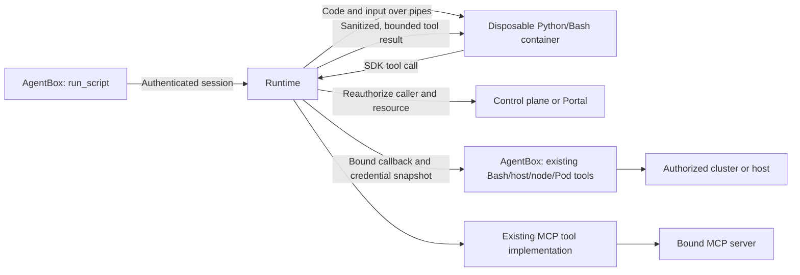
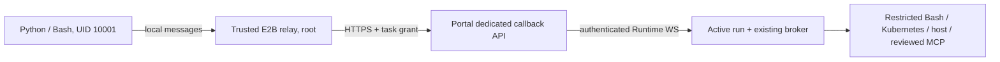

# Disposable script sandbox

Status: opt-in implementation. `run_script` supports Bash and Python's standard
library in a separate container. Both the feature and optional network isolation
default to **off**. Kubernetes deployments support native Jobs or optional E2B.
LocalSpawner and headless CLI invocations always disable this feature, regardless of
environment settings. Docker is only used by the standalone smoke harness.

## Security contract




The runner has no AgentBox filesystem, service account token, kubeconfig, SSH
key, MCP token, cloud environment or Runtime certificate. It receives only code,
JSON input, and a pipe protocol. Code must not embed credentials in its own input.
Requested resource names narrow authority; they do not grant it. Raw credentials,
identity fields, arbitrary images, mounts, environment and connection addresses
are rejected as tool parameters.

Runtime derives the Agent identity from its existing authenticated AgentBox
transport and passes the session ID to `sandbox.resolve`. The upstream control plane additionally
checks the authenticated Runtime owns the Agent, the session belongs to that
Agent, and the user still has access. Cluster/host access is the intersection of
the user's module/resource group grants and the Agent's current resource
bindings. Credentials are resolved again for each operation and stay in trusted Runtime
connectors or the existing AgentBox credential store. They never travel through
the sandbox channel. Connector errors are replaced
with generic errors; audits contain identities, run/instance IDs, code hashes,
operation outcomes and timing, without code or credentials.

Both Web entry points atomically claim a new session ID for the authenticated
user before subscribing to events or dispatching a turn. Existing IDs must
match the user, Agent and live Web session; conflicting inserts preserve the
original owner, lineage, title and message sequence.

Runtime additionally binds each script to the current authenticated Web turn.
The saved session owner is compared with this caller, never used as a substitute
for it. An explicit `origin: "web"` is required from the control plane; missing
or non-Web origins and delegated turns fail closed. Each tool operation and
result chunk rechecks the live caller. Mixed users or entry types make the
whole overlapping turn ineligible until it finishes, including steers. Ending
the turn removes its authority; restart cannot reconstruct it from an old
session row. This also prevents an API request from enabling a sandbox by
reusing its owner's saved Web session ID.

A same-user Web handoff replaces the active executor even when the source's
terminal cleanup overlaps the destination's start. Source cleanup cannot remove
destination authority, and destination completion cannot restore the old source.
The control plane must independently authorize the session's current executor,
its Runtime and bindings; a live local turn alone does not grant resource access.

Initial access is limited to non-delegated, logged-in **Web sessions**. Channel,
API, task, sub-agent and delegated sessions are excluded until the current
requester's identity can be verified independently of session ownership.
Standalone Portal has no resource RBAC, so it requires an administrator-owned
Web session and still enforces Agent resource bindings. Headless CLI execution is
not exposed. LocalSpawner ignores sandbox configuration before loading secrets
or initializing providers, advertises the feature as disabled, and rejects
execution and external tool callbacks. Agents receive no `run_script` tool.

Existing legacy `*_exec`/`*_script` and direct AgentBox MCP tools are separate
capabilities. This feature constrains code inside the new sandbox; it does not
retrofit the entire AgentBox into an untrusted-code boundary. The broker never
dispatches through the general tool registry. `run_sandbox` grants only
`run_script`; `run_scripts` retains the legacy Skill tools. Use a custom Agent
with only `run_sandbox` for a sandbox-only workflow: direct MCP discovery and
tool injection are disabled for that selection, including session rebuilds.
Bound MCP resources remain accessible through the reviewed broker policy.
The SRE preset intentionally
retains both capabilities. Empty capability selection remains unrestricted.

## One tool execution policy

The sandbox executes Python/Bash orchestration and local data processing. Its
SDK invokes the existing Agent tools; Runtime does not implement Kubernetes
queries or inspect command syntax. There is no second command whitelist,
fixed Kubernetes GET implementation, or remote inspection helper.

| SDK operation | Implementation |
| --- | --- |
| `bash` | Existing `createRestrictedBashTool`, including the shared kubectl read policy, command whitelist, rate limits and output sanitizers. Use it for get/describe/logs and other queries allowed by that tool. |
| `host_exec` | Existing `createHostExecTool` and its host command policy, with an approved credential snapshot and pinned SSH hops. |
| `node_exec` | Existing `createNodeExecTool` and its node command policy, with bounded diagnostic Job lifecycle. |
| `pod_exec` | Existing `createPodExecTool` and its Pod command policy, with a remote timeout. The target container must provide `timeout`. |
| `mcp.call` | Shared `createMcpToolDefinition`; bound server/tool authorization and fixed resource arguments apply before dispatch. |

The main Agent obtains MCP names, descriptions and parameter schemas through its
existing MCP tool inventory. Discovery follows `tools/list` pagination before
publishing a server's inventory. Repeated cursors, duplicate names, a later-page
failure, or the 32-page/1,000-tool/4-MiB/30-second discovery budget fail the server's
discovery without publishing a partial list. These are transport safety budgets,
not an additional schema copy for scripts.
It writes the complete orchestration script from
that information. The runner SDK exposes fixed `call`, `call_to_file` and Shell
entry points; it does not discover tools, generate per-tool wrappers, or rewrite
scripts at execution time. An Agent tool named `mcp__metrics__query` maps to SDK
operation `mcp.call` with `server: "metrics"`, `tool: "query"`, and `arguments`
matching that MCP tool's schema. The run must declare the same server/tool.

MCP returns its standard `content`, optional `structuredContent`, and optional `isError`,
not the Bash `text` envelope. Missing `isError` means false; in Python, check
`result.get("isError", False)`. Prefer `structuredContent` when
present, and otherwise interpret text content using the tool's documented format.
SDK file delivery stores this same MCP result at the file's JSON root, without
a new wrapper. Do not require an `isError` property or search nested wrappers
to recognize a successful MCP result.
Knowing a tool's schema does not grant permission to execute it: the broker
still checks the current binding and reviewed operation policy.

The sandbox-only capability selection intentionally suppresses direct MCP tool
injection. It does not have the ordinary Agent's MCP inventory; required schemas
must already be supplied in its task/context. This remains a distinct limitation,
not a reason to add discovery or credential access inside the runner.

Command acceptance is owned by the normal built-in implementations. Their
existing `preExecSecurity` and `postExecSecurity` paths run once at execution;
the SDK does not maintain an additional command/flag/file list. The trusted
callback validates arguments against the selected built-in's own published
schema. A future command-policy fix therefore affects both direct Agent calls
and scripts. Connection/identity overrides and kubeconfig mutation are rejected
by the shared kubectl policy, including shorthand flags and all subcommands.

Each SDK call still reauthorizes the current user, Agent capabilities, Web turn
and resource binding. `run_sandbox` does not grant another tool's capabilities:
Bash/host/node/Pod tools also require current `run_commands`. Cluster selection
is explicit: `clusters: [{"name": "prod"}]` permits calls only to that currently
bound cluster. Namespace/resource permissions are those of the existing tools
and the approved credential's Kubernetes RBAC. The sandbox does not create a
second namespace/resource authorization system. Earlier `nodes`/`namespaces`
request fields are rejected, never silently ignored. Deprecated fixed query
operation names are rejected before obtaining credentials.

Runtime selects only the four registered built-in callback targets above. The
AgentBox callback verifies the original immutable resource scope, owning Web
session, random per-run grant and Runtime mTLS identity. No command goes through
the model prompt queue. The callback uses a fresh, private credential snapshot
instead of the ambient credential cache, so rebinding/refresh cannot substitute
a different credential. Snapshots are removed after tool cleanup. They are
never serialized to the runner, SDK output or audit. Inline kubeconfig validation
rejects credential plugins, file references, proxy settings and impersonation.

MCP server/tool eligibility and fixed tenant/resource arguments are authorization,
not a second command review. Only configured bound HTTPS Streamable HTTP servers
are supported, using the shared Agent MCP tool factory with bounded transport,
no redirects and cancellation. MCP `readOnlyHint` alone does not authorize a
call; server implementation and upstream credential permissions remain trusted.
SSH key pins are required on every hop, and the existing host tool verifies them.

Python and Shell share the same SDK protocol and tools:

```python
import json
from siclaw import call
result = call("bash", {"cluster": "prod", "command": "kubectl get nodes -o json"})
for node in json.loads(result["text"])["items"]:
    print(node["metadata"]["name"], node["status"]["nodeInfo"]["kernelVersion"])
```

```bash
siclaw-tool bash '{"cluster":"prod","command":"kubectl logs api -n app --tail=100"}'
siclaw-tool host_exec '{"host":"host-a","command":"uname -r"}'
```

The shell in the runner performs local orchestration. `siclaw-tool bash` invokes
the remote Agent tool; it does not run kubectl inside the runner. Both languages
have the same resource authorization, tool policies, limits and cancellation.
Prefer direct Agent tools for simple diagnostics and scripts for aggregation.
There is no package installation or direct production credential access.

The model receives the SDK imports, operation arguments, result contract and
filesystem guidance through the registered `run_script` tool description and
parameter schema. This compact contract reuses the main Agent's existing MCP
schemas without copying them into `run_script` or generating SDK functions.
Detailed examples and architecture remain in this document, outside the model's
tool description. With 10-lane guidance and deployed budgets, a representative
complete tool definition is 1,003 `o200k_base` tokens (990 `cl100k_base`),
18 more than the preceding 985-token contract.
Other tool schemas, provider wrapping and conversation history also occupy
context; prompt caching does not remove that occupancy.

For a remote batch, reuse an already successful representative sample or make
one ordinary direct tool call to check arguments, authorization and result
shape. Then write the complete script. When direct tools are unavailable, check
the first SDK response in that script before continuing the batch. Prefer a
bulk query or existing input over repeated remote queries, validate required
fields, and report per-resource errors alongside successes. This is planning
guidance, not an extra permission gate or an unconditional probe per request.

The existing authenticated Runtime capability endpoint publishes only public
timeout, SDK call and stdout/stderr budgets plus network-isolation defaults.
AgentBox projects these fields into the tool description and timeout schema;
provider configuration and credentials are never forwarded. Missing budgets
from an older Runtime use conservative guidance, and Runtime still enforces its
limits independently. Batch planning must account for bounded parallel SDK operations,
shared-target queue time and node diagnostic startup/cleanup; a command's own timeout is not the whole
callback duration.

Its working directory is `/work`; scripts can create, read,
modify and delete their own work files and use `/tmp` for scratch space. These
local operations need no SDK call. Files disappear after the run and are not
shared with later runs. Native Kubernetes runners have a read-only image root,
64 MiB `/work` and 32 MiB `/tmp` memory-backed volumes, plus process/container
resource limits. This local write access never grants remote write authority;
SDK calls retain the original tools' authorization and command policies.

Built-in command results contain `text` (sanitized stdout), `stderr`, `notices`,
`exit_code` and `exit_class`. Parse `result["text"]` for JSON commands; stderr
warnings, redaction notices and execution annotations never get appended to it.
The existing tools' shared sanitizers produce these separate channels, preserving
JSON syntax through broker sanitization as well. Direct Agent calls retain their
normal combined display. Check the exit classification and notices for no-match
or bounded-window results; failed or truncated calls are rejected. MCP results
retain the shared MCP tool's result shape.

## Tool budgets and diagnostic cleanup

Tool commands have a 1–15 second budget. Background execution is unavailable
without background wiring, and node diagnostic images come from service
configuration; these choices are represented in the existing tools' schemas.
Each Runtime defaults to **10 active scripts**, with **10 concurrent SDK calls**
per script. Python can use `ThreadPoolExecutor(max_workers=10)`; Shell can use
at most ten background workers followed by `wait`. Ten atomic file mailboxes
and process-shared lane locks correlate out-of-order results. An accepted request
keeps its lane occupied until the supervisor receives a reply, even if that SDK
client is killed. Large replies cannot block the supervisor on a dead reader. Runtime and
AgentBox independently reject extra in-flight frames and replayed call IDs.

All sandbox tools acquire shared target capacity before execution. The trusted
Runtime hashes the authorized endpoint, never a script-provided URL or quota:

| Target | Default active tools | Rate budget |
| --- | ---: | --- |
| Cluster API origin | 10 across all Runtime instances | 10 calls/s, burst 20 |
| MCP origin | 10 across all Runtime instances | 10 calls/s, burst 20 |
| Same host address/port, node, or Pod | 1 | Included in its cluster budget when applicable |

Bindings with different names but the same endpoint share capacity; unrelated
endpoints can proceed independently. Pod execution shares one slot across its
containers, including an omitted/default container name. Endpoint aliases with different origins
are distinct targets. The limit counts tool invocations, not every underlying
HTTP request. MCP discovery/handshakes and upstream work can generate additional
requests. Ordinary direct Agent calls retain their existing limits; this gate
covers SDK traffic, not all traffic to the upstream service.

Standalone Portal owns the shared admission gate in its single process. A
multi-replica control plane implements `sandbox.traffic.acquire` and
`sandbox.traffic.release` atomically in shared storage. Neither RPC is exposed
to scripts or public callbacks. An unavailable coordinator fails closed, without
falling back to a per-Runtime counter. The target ceiling, rate and burst are
operator settings (`SICLAW_SANDBOX_TARGET_CONCURRENCY`, `_RPS`, `_BURST`, each
with the full `SICLAW_SANDBOX_TARGET` prefix); standalone Helm settings are under
`scriptSandbox.traffic`. Leaf-target concurrency stays one.

Admission waits at most 25 seconds, with at most 100 queued calls per target and
1,000 overall. Contending users receive scheduling preference over repeated
calls from the current user. Waiting consumes the script deadline. After
admission, Runtime resolves current authorization and credentials again and
refuses a changed target. A full/expired queue returns `TARGET_BUSY`; the SDK
raises a clear busy error, with no automatic retry or script rewriting.
Confirmed tool completion releases the slot. Uncertain transport loss retains
its 150-second lease, rather than allowing another request while the previous
execution may still be active. Expiry bounds owner-loss recovery; upstream
services with work that outlives a disconnected request need their own limits.

Node diagnostics use `siclaw-script-diagnostics` in the target cluster. The
trusted node tool creates only this labeled namespace and its quota when absent.
An existing unlabeled namespace, conflicting/scoped quota, missing permissions
or quota above the ceiling causes refusal. `count/pods: 10` and
`count/jobs.batch: 20` include terminal/terminating objects and apply across
Runtime/AgentBox replicas and restarts. Operators may provision a stricter quota.
Ordinary direct node tools keep their existing namespace/lifecycle.

For restricted installers, an operator can apply
`examples/script-sandbox-diagnostics.yaml` to each authorized **target** cluster
before enabling `node_exec`. It explicitly selects the privileged PSA level
needed by the existing trusted diagnostic tool. This is separate from the
runner namespace, which remains restricted and has no production credentials.
The bound cluster identity still needs the tool's Job/Pod create, inspect, exec
and delete permissions. Existing conflicting namespace policy is never loosened
automatically; missing facilities return `DIAGNOSTICS_UNAVAILABLE`.

Every callback retains diagnostic Job ownership independently of cache entries,
with foreground deletion before credential disposal. A removed cache entry or
lost create reply cannot discard cleanup responsibility. Jobs have no retries,
a 120-second active deadline and a 60-second finished TTL. Their container also
stops at an absolute deadline chosen **before admission**: the earlier of the
script deadline and 100 seconds after admission was requested. A delayed Job
cannot restart a fresh relative lifetime. This assumes host clocks are within
five seconds; 34 seconds of cleanup headroom still fits inside the 150-second
admission lease. The namespace object quotas remain the hard accumulation bound
under control-plane failure, even for terminated or delayed objects.

The shared budget constants live in `src/script-sandbox/budgets.ts`. Runtime
callbacks use 55 seconds (125 for nodes), clamped by the script's AbortSignal;
AgentBox applies the trusted absolute deadline. Cleanup has its own bounded
attempts and may continue after the caller stops waiting. No timeout proves
that a third-party MCP service stopped detached work.
External ingress adds transport grace without extending the run's grant.

Read-only means the existing tools' diagnostic command policies. Node diagnostics
create and delete Kubernetes infrastructure; scripts can create/delete their own
work files. Diagnostics can produce audit records and retrieve sensitive output.
Shared output redaction is not a proof that arbitrary service data contains no
secret. Tool implementations, host binaries, configured images and reviewed MCP
services are trusted parts of the execution boundary.

## Large results and work files

Use `call_to_file` for complete, bounded **sanitized** results. The normal
`call` response remains limited to 128 KiB. File delivery allows 4 MiB per result
and 16 MiB cumulatively per run; it does not bypass a connector's pagination,
field projection or log-window limits.

```python
import json
from siclaw import call_to_file
info = call_to_file("mcp.call", {
    "server": "metrics", "tool": "query", "arguments": {}
}, "data.json")
with open(info["path"]) as data:
    result = json.load(data)
# Aggregate/filter result here, then print only the final answer.
print({"bytes_processed": info["bytes"]})
```

```sh
siclaw-tool --output data.json mcp.call '{"server":"metrics","tool":"query","arguments":{}}' > receipt.json
python3 -c 'import json; data=json.load(open("data.json")); print(type(data).__name__)'
```

The SDK requests `delivery: "file"`; no file path or download URL is sent to
Runtime. Runtime executes the authorized tool once, sanitizes its response and
holds at most ten independent result buffers, each capped at 4 MiB and
collectively subject to the 16 MiB cumulative budget. This is bounded buffering,
not unlimited upstream streaming. A random run-local transfer ID identifies the
buffer. `result.read` returns sequential chunks of at most 48 KiB, reauthorizing
the **original** user/resource on each chunk without repeating the operation.
Skipped/replayed offsets, other runs, cancelled runs and revoked resources are
rejected. Data is discarded at EOF, explicit `result.discard`, or run completion.
Chunk requests have a separate bounded protocol budget and do not consume the
512 default upstream tool-call slots. Failed/discarded files still consume the cumulative
admitted-byte budget.

Python and Shell share the same SDK. It checks byte count and SHA-256 before an
atomic replacement inside the current work directory. Failure removes partial
files and preserves an existing destination. Complete files live only in this
run; process them before returning. The SDK performs no automatic retry of the
original operation. Public callback request/response limits remain 256 KiB;
Portal and external control planes only relay small messages to the original
live Runtime. No object store, public download endpoint or file credential is
needed.

The trusted built-in callbacks use the shared sanitizer in data mode, without the
chat renderer's truncation or host temporary files. File delivery saves the same
result envelope, so parse its `text` field for command JSON. Runtime caps the internal
callback at 4 MiB; existing tool execution capture limits still apply and
capture failures are rejected. Only script stdout/stderr reaches the Agent,
with the existing combined 128 KiB limit and explicit `output_truncated` flag.
Scripts should inspect all required pages and print a concise summary, not dump
raw files to stdout. Data too large for these budgets requires narrower queries
or pagination; partial data is never presented as a successful file.

Deploy matching Runtime, AgentBox and runner images. Runner readiness protocol
version **3** requires the ten-lane SDK; old native images or E2B templates
fail the handshake before receiving task data. Rebuild the E2B template when
upgrading the SDK. No model call, package installation or extra service is added
to sandbox startup.

## Failures, policy updates and rolling upgrades

Python raises `siclaw.ToolError` with `code`, `execution`, `cleanup`, optional
`retry_after_ms` and a sanitized `result`. `NOT_DISPATCHED` means rejected before
execution; `FINISHED` means a trusted executor replied; `UNKNOWN` means transport
or cancellation prevented confirmation. A command error can still be a finished
execution. `cleanup=pending` retains target capacity and is not safe to retry
just because the command ended. The SDK never automatically retries. Shell
reports the same structured failure as JSON and exits nonzero.

`run_script` separately reports runner `cleanup` and includes a notice if it is
unconfirmed. It keeps the script's exit/result information. Final stdout/stderr
use the shared output sanitizer and the combined byte limit before reaching the
model. Redaction notices stay separate from JSON/NDJSON data. Redaction does not
establish confidentiality for arbitrary encodings or transformed secrets.

Policy and host-pin files are re-read at each authorization boundary. Kubernetes
projected ConfigMap updates take effect when the kubelet updates that projection;
Helm also rolls Runtime on policy changes. Environment-only policy changes require
a restart. Bad replacement files fail closed. Result delivery and every file chunk
must match both current grants and the originally authorized credential/endpoint
snapshot; policy changes cannot expose an old result under a new binding.

Upgrade the control-plane `sandbox.traffic.info` v1/acquire/release API first,
then matching Runtime and AgentBox images, and the runner image or E2B template.
Native readiness remains v3; SDK and supervisor mailbox changes ship together in
that image. An unavailable or older coordinator is rejected before a runner is
started. Unsupported runner handshakes trigger a short cooldown. Rollback should
disable sandbox first, drain runs, and restore matching image digests together.
No database migration is required. Disabled/local/CLI environments do not parse
unused provider credentials, policies or traffic settings.

Standalone Portal's shared Runtime secret defines one trusted service domain;
it is not authentication for mutually untrusted Runtime tenants. Use separate
Portal deployments and secrets for separate trust domains. The external control
plane additionally binds an executor to its authenticated Runtime identity.

## Optional network isolation

`network_isolation` defaults to the Runtime setting (off). Administrators may
set `requireNetworkIsolation=true`; a request cannot weaken it. Failure to load
the filter or start the requested profile aborts execution, without fallback.

The immutable native launcher closes extra descriptors, rejects inherited socket
stdio, resets environment/limits, sets `no_new_privs`, and installs a Linux
seccomp **syscall allowlist before Python loads**. The allowlist applies to the
supervisor and descendants. It denies sockets, io_uring, ptrace, process_vm,
pidfd_getfd, namespace entry/creation and unknown ABIs/syscalls. It permits only
the filesystem/process primitives needed by Bash and stdlib Python. `clone3`
returns ENOSYS so libc can use the inspectable `clone` fallback. The container
also uses a distinct non-root UID per instance, read-only rootfs, dropped capabilities, no host
namespaces, no token mount and bounded tmpfs volumes.

There is no CNI dependency or node-local seccomp profile to distribute. The
tool channel remains available while direct HTTP, SSH, DNS and package downloads
are unavailable. Docker adds `--network=none`. A configured gVisor/Kata
RuntimeClass can strengthen the kernel boundary, but is not required. Ordinary
containers still share a kernel and do not claim microVM-level isolation.

For a deployment that guarantees code can access infrastructure **only through
tools**, set `requireNetworkIsolation: true`. Requests specifying `false` cannot
weaken that deployment policy.

When isolation is **off**, arbitrary network access is intentionally possible.
Absence of mounted credentials is sufficient only when the execution environment
does not offer ambient production identity (for example, node cloud metadata or
unauthenticated/IP-trusted services). Use forced isolation where that assumption
does not hold. “No CNI dependency” is not a claim that an open network blocks
anonymous access to production.

Admission changes are checked before submitting task data: injected sidecars,
init containers, env, credential/host volumes and weakened container security
are rejected, as are changes to runner lifetime, stdio, resource limits,
bounded tmpfs storage and service-link settings. Dedicated execution namespaces must not have workload-identity,
service-mesh or credential-injection policies. Operators control the image and
cluster admission infrastructure; the runner cannot choose either.

## Startup and resource budget

The image contains Python 3.12 slim, Bash, the stdlib runner/SDK and one small C
launcher. It contains no Node, AgentBox, kubectl, SSH client or MCP server.
There is no package download, agent initialization, credential mount or model
call during startup. Images use `IfNotPresent`; preloading the image on intended
nodes removes registry latency from the first run.

Each Runtime maintains a configurable **one-use warm pool** (default one, zero
disables prewarming). The two seccomp profiles never share or convert instances.
Instances enter the pool only after an attach/hello/ready handshake. Idle
instances contain no user data or authority. Claiming one transfers it to one
run; it is destroyed after success, failure, timeout or cancellation and is
never scrubbed/reused. Cold runs provision before speculative replacements, and
requests join existing warmup instead of competing with it for the last Pod slot.
Only the deployment
default profile is prewarmed. Other profiles cold-start without replacing the
default pool, avoiding churn when requests alternate profiles. Finished or failed
idle channels are retired; failed deletion retains ownership and stops refill. Waiting for
provisioning is reported as a cold start. Pools replenish asynchronously. Warm instances expire
after 300 seconds by default and are terminated on Runtime shutdown.

Defaults: ten active runs per Runtime, 300-second maximum execution, 90-second
startup ceiling, 128 KiB combined output, 512 tool calls, 1 CPU / 256 MiB limits,
64 MiB `/work` and 32 MiB `/tmp`. Requested CPU/memory are 20m/64Mi. The launcher
caps descriptors, processes and core dumps; Docker additionally sets a PID limit.
Linux RLIMIT_NPROC is per host UID. Runtime-generated instance IDs derive UIDs
above the normal system-user range, avoiding shared-UID starvation on busy nodes.
Hash collisions remain possible; a node/runtime PID policy can supplement the
128-process limit. Docker also enforces its own 64-PID cgroup limit.
Per-namespace quotas include active jobs, idle instances and cleanup overlap.
Runtime replicas each have their own pool/concurrency ceiling.

The supervisor has its own lifetime alarm, and K8s Jobs have an active deadline,
zero retries and TTL cleanup. These bound orphan lifetime after controller loss.
Code and input are transferred over attach/stdin, never stored in Pod/Job specs,
ConfigMaps or labels. Cleanup uses the created Job UID as a delete precondition.
Runtime waits for foreground deletion to remove the Job before reporting confirmed
cleanup. Failed deletion retains a cleanup handle and a provider capacity slot;
later starts and shutdown retry it. A lost CREATE reply is reconciled by its
unpredictable invocation name and then fenced by the observed UID. An immediate
404 without an observed UID is still uncertain, so the handle is retained for
reconciliation instead of assuming that a delayed CREATE cannot commit.
Quota/admission FailedCreate events return an early capacity error. Runtime only
needs read access to those events, in addition to its existing runner permissions.

Results report `startup_ms` (provider acquisition/readiness), `warm`, and
`duration_ms` (authorization + startup + execution + cleanup). A warmed claim
avoids Pod scheduling, image pull and supervisor startup. A child interpreter
still starts for the one task; this, authorization and connector latency remain
in the total duration. No cold/warm millisecond target is asserted without
measurement on the target cluster.

Standalone Portal stores chat content and structured tool metadata in MEDIUMTEXT
on MySQL, including an idempotent upgrade from TEXT. This accommodates the
bounded script output without interrupting the live stream or losing history.
SQLite continues using its existing text-storage semantics.

## Configuration and examples

Build the image outside production:

```sh
docker build -f Dockerfile.script-sandbox -t registry.example/siclaw-script:VERSION .
```

Opt in through Helm `scriptSandbox` values. Set `enabled: true` and `image` to an
operator-built image (prefer an immutable digest). A dedicated execution
namespace, tokenless ServiceAccount, controller Role/RoleBinding and quota are
created. `createNamespace: false` uses an existing dedicated namespace, which
must already enforce the restricted Pod Security Standard. The runner account
has **no RoleBinding**. The Runtime account receives only Job create/get/delete,
Pod get/list and Pod attach in this namespace. It gets no production RBAC from
this chart addition. Private images must be preloaded on execution nodes in this
version; imagePullSecrets are not supplied by script requests.

```yaml
scriptSandbox:
  enabled: true
  image: registry.example/siclaw-script:VERSION
  networkIsolation: false
  requireNetworkIsolation: false
  warmPoolSize: 1
  mcpPolicy:
    metrics:
      query:
        fixedArguments:
          tenant: team-a
  hostKeyPins:
    worker-1: SHA256:REPLACE_WITH_VERIFIED_43_CHARACTER_FINGERPRINT
```

Local deployments cannot enable this feature, including through provider or
enablement environment variables. There is no fallback to running arbitrary
code on the developer host. Helm
fields map to `SICLAW_SCRIPT_SANDBOX_*` environment variables; MCP policy and
host pins are JSON files selected by `MCP_POLICY_FILE` and `HOST_KEYS_FILE`.
Configuration changes require a Runtime restart; warmed profiles are replaced.

Example tool request:

```json
{
  "language": "python",
  "code": "import json\nfrom siclaw import call\nresult = call(\"bash\", {\"cluster\": \"prod\", \"command\": \"kubectl get nodes -o json\"})\nfor node in json.loads(result[\"text\"])[\"items\"]:\n    print(node[\"metadata\"][\"name\"], node[\"status\"][\"nodeInfo\"][\"kernelVersion\"])",
  "clusters": [
    {
      "name": "prod"
    }
  ],
  "network_isolation": true,
  "timeout_seconds": 30
}
```

Python uses `from siclaw import call, call_to_file, input_data`; Bash uses
`siclaw-tool TOOL '{"argument":"value"}'` and reads `$SICLAW_INPUT_FILE`.
Call the zero-argument function `input_data()` to read the `run_script.input`
parameter as a decoded JSON value. Omitted or JSON `null` input returns Python
`None`. For example, with `input: {"numbers": [1, 2, 3]}`:

```python
from siclaw import input_data

payload = input_data()
print(sum(payload["numbers"]))  # 6
```

The SDK supports ten cross-process lanes, each with a file lock and atomic request/reply mailbox.
Bash/exec results have a `text` field. With `kubectl -o json`, parse that field
as JSON. File delivery saves the same result envelope, not a different API.

The `run_script` description gives the model the SDK contract and points it to
the existing tools' command rules. Use exact bound resource names from the user
or available context. Scripts cannot discover credentials or select arbitrary
connection URLs. MCP operation arguments must be known from the bound tool's
documentation; this version does not dynamically publish its schemas through SDK.

For example: "Use the script sandbox and the built-in Bash tool to list every
node in my-cluster and aggregate node name, kernel version and allocatable CPU.
Save raw tool results locally, print the final table and report incomplete data."

## Validation

```sh
npx vitest run src/script-sandbox src/gateway/script-sandbox src/portal/script-sandbox.test.ts
python3 -m unittest discover -s docker/script-sandbox -p '*_test.py'
npx tsc --noEmit
npm test
npm run build
SICLAW_SCRIPT_SANDBOX_IMAGE=siclaw-script:test npx tsx scripts/smoke/script-sandbox.ts
```

The last command needs Docker and a built image. It checks Python/Bash + SDK,
socket denial for IPv4/IPv6/Unix, raw syscall bypasses, subprocess inheritance,
no token mount, one-use state, timeout/cancel, and prints cold/warm timings.
The Kubernetes variant requires an explicit disposable `kind-*` context and the
`siclaw-script-smoke` namespace/ServiceAccount. See the Script Sandbox CI workflow,
which builds/tests native amd64 and arm64 images and exercises Kind on amd64.
The macOS Python protocol tests alone do not establish Linux isolation or
container startup performance.

## E2B provider

`SICLAW_SCRIPT_SANDBOX_PROVIDER=e2b` selects the external microVM provider.
The agent still uses `run_script`, Python `siclaw.call()` and Bash `siclaw-tool`.
No URL, token, image, environment or credential parameter is added to the tool.
The default provider remains Kubernetes; the feature and optional networking
isolation remain disabled by default.



The operator configures the callback service's canonical HTTPS origin once,
using `SICLAW_SANDBOX_PUBLIC_URL` (Helm `scriptSandbox.publicUrl` for standalone
Portal). The service appends `/api/v1/siclaw/sandbox/tools`; request Host and
forwarded headers never select token destinations. The public route accepts
only `{call:{id,tool,arguments}}` with a task Bearer token. It cannot call
`sandbox.resolve`, read credentials, select identities, or invoke arbitrary RPCs.
Standalone Portal retains its existing single-instance deployment constraint.

After authorizing a run, Runtime generates a random 256-bit task token and
registers its SHA-256 hash through the authenticated `sandbox.lease.open` RPC.
The registration binds the Runtime, run, Agent and Web session and expires
within the script timeout plus 10 seconds (maximum 610 seconds). It returns
the configured callback URL. Each callback is checked at ingress and again
against Runtime's live run before entering the **same** scope checks, replay
detection, ten concurrent callbacks, call budget, output limits and bounded tool
deadline as a Pod pipe request. Current resource authorization is still checked
on every operation. No token refresh or automatic request retries occur.

Completion and cancellation remove the live grant synchronously and revoke the
ingress hash. Runtime restart loses every active grant. An ingress outage or a
failed revoke cannot keep a completed run callable. Callback routing is exact,
and RPC responses must arrive on the originating WebSocket. The existing
AgentBox callback grant is separate and never enters E2B.

The E2B API key stays in Runtime and authenticates provisioning/deletion calls
to E2B's control API. A separate sandbox-scoped envd token authenticates process
control; the account API key is never sent to envd or the VM. Runtime requires
`secure:true` and a returned envd access token,
disables public guest ingress, rejects redirects and validates the returned
sandbox domain. A trusted root relay receives the task URL/token via envd
stdin, without putting them in command arguments, environment or work files.
It drops all groups and UID/GID to 10001 **before** starting the existing runner.
Only the original script start frame reaches the unprivileged runner.

The root relay disables process dumps; scripts cannot read its memory, fds or
environment. The launcher sets `no_new_privs` in both profiles and optionally
installs the inherited socket-denying seccomp filter. Thus the relay can call
HTTPS while isolated code cannot create sockets, including through subprocesses.
`requireNetworkIsolation:true` forces this mode regardless of the script's
request. Standard mode permits code networking and offers no tool-only network
guarantee. No CNI, per-node seccomp installation or runtime package download is
required. These controls depend on the reviewed template, E2B/envd and the
Linux kernel; they do not claim protection from all kernel vulnerabilities.

### Service configuration and template

Build `Dockerfile.script-sandbox`, then build `Dockerfile.script-sandbox-e2b`
with `SANDBOX_IMAGE` set to the first image. The second image adds only a Python
standard-library relay and removes privilege-changing executables/bits; it
does not install a second SDK, AgentBox, Kubernetes client or SSH client.
Use this image as an operator-built E2B template. For example, in an operator
environment with E2B's template SDK installed and a registry image accessible
to E2B:

```js
import { Template } from "e2b";
const template = Template().fromImage("registry.example/siclaw-script-e2b@sha256:...")
  .setUser("root").setStartCmd("sleep infinity", "test -x /usr/local/bin/siclaw-launcher");
await Template.build(template, "siclaw-script-v1");
```

Set Runtime's `E2B_API_KEY` through a service secret, or use
`SICLAW_SCRIPT_SANDBOX_E2B_API_KEY_FILE` for a private mounted file. Set
`SICLAW_SCRIPT_SANDBOX_E2B_TEMPLATE` to the built template name/ID. Optional
service settings `SICLAW_SCRIPT_SANDBOX_E2B_API_URL` and
`SICLAW_SCRIPT_SANDBOX_E2B_DOMAIN` default to `https://api.e2b.app` and `e2b.app`.
Custom API origins must use HTTPS; sandbox domains must match the configured
domain. The runtime implementation uses native HTTP with the E2B REST and
envd Connect JSON protocols; no production dependency was added.

```yaml
scriptSandbox:
  enabled: true
  provider: e2b
  publicUrl: https://portal.example
  requireNetworkIsolation: true
  warmPoolSize: 1
  e2b:
    template: siclaw-script-v1
    apiKeySecret: siclaw-e2b # Pre-existing Runtime-only Secret, key: api-key.
```

The Helm E2B profile creates no execution namespace, runner ServiceAccount or
runner RBAC. Policies still live with Runtime. Kubernetes remains supported
without any public callback address or E2B configuration.

Prewarming starts the template, unprivileged launcher and pipe handshake before
a request. Idle instances contain no user code, task token or resource scope;
the grant is created only on claim. Every claimed instance is deleted, and E2B's
finite sandbox timeout bounds orphans after a Runtime crash. Changing isolation
profiles creates a compatible instance. Cloud provisioning and geographic RTT
remain separate from the measured runner startup; a protocol mock does not
establish real E2B cloud latency.

### Verification

The E2B tests exercise actual REST/Connect request envelopes, secure-envd and
domain rejection, authenticated callback binding, scope/budget reuse, token
expiry/revocation, redirect refusal and bounded protocol parsing. Portal tests
exercise its HTTP route and exact Runtime routing. Run
`scripts/smoke/e2b-relay.sh` with `SICLAW_E2B_SMOKE_IMAGE` set to the built template
image to test actual Linux UID/seccomp enforcement, Python/Shell HTTPS callbacks,
root process and private file access denial, and redirect rejection. The script
uses temporary local TLS fixtures and requires no E2B account. A real E2B API key,
built template and externally reachable HTTPS callback service are required for
cloud end-to-end validation.
